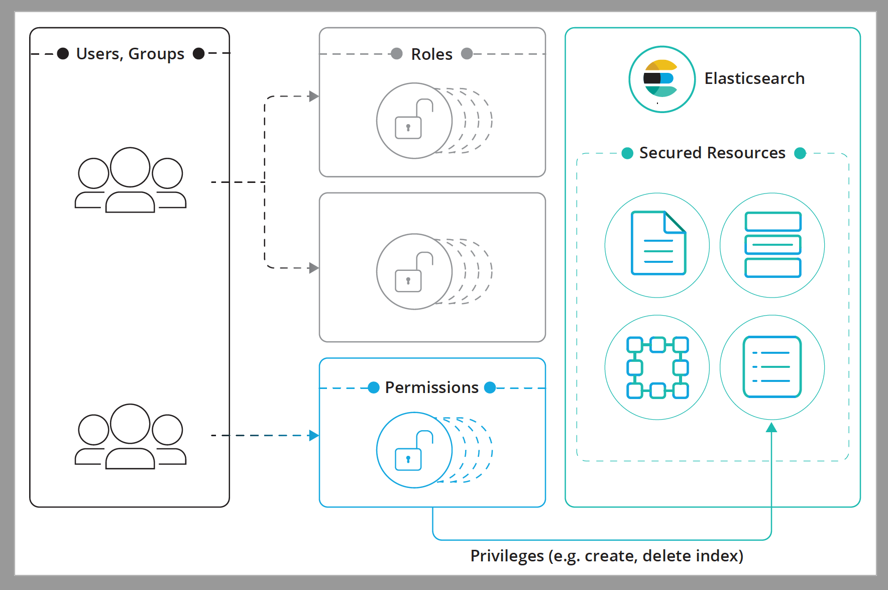

# Elastic Stack 安全特性说明
## User authentication【用户身份验证】

[设置连接](https://www.elastic.co/guide/en/elastic-stack-overview/7.1/built-in-users.html#set-built-in-user-passwords)

身份验证标识个人。要访问受限制的资源，用户必须通过密码、凭据或其他一些方法(通常称为身份验证令牌)来证明自己的身份。

Elastic Stack 通过识别攻击集群的请求背后的用户，并验证这些用户是他们自称的用户，从而对用户进行身份验证。身份验证过程是由一个或多个身份验证服务调用处理领域。

您可以使用本机支持来管理和验证用户,也可以与外部用户管理系统(如 LDAP 和 Active Directory)集成。

Elastic Stack 安全功能提供内置领域,如本机、ldap、active_directory、pki、文件和 saml。如果没有内置领域满足您的需求,您还可以构建自己的自定义领域并将其插入Elastic Stack 。

当启用安全特性时，根据您所配置的领域，您必须将用户凭证附加到发送到Elasticsearch的请求上。例如，当使用支持用户名和密码的领域时，您可以简单地将基本的auth头附加到请求上。

安全特性提供两个服务:令牌服务和api密钥服务。您可以使用这些服务将当前身份验证交换为令牌或密钥。然后，这个令牌或密钥可以用作对新请求进行身份验证的凭据。默认情况下，当为HTTP启用TLS/SSL时，将启用这些服务。
## User authorization【用户权限】
[设置连接](https://www.elastic.co/guide/en/elastic-stack-overview/7.1/built-in-roles.html)

Elastic Stack安全特性添加授权，这是一个确定传入请求背后的用户是否被允许执行请求的过程。
此过程发生在成功标识和验证用户之后。

## role-based access control[基于角色的访问控制] (RBAC)
安全特性提供了基于角色的访问控制(RBAC)机制，该机制允许您通过向角色分配特权和向用户或组分配角色来授权用户。

授权过程围绕以下结构进行:

**受限的资源**

>访问受限的资源。索引、别名、文档、字段、用户和Elasticsearch集群本身都是受保护对象的示例。

**特权**

>由一个或多个操作组成的命名组，用户可以对受保护的资源执行这些操作。每个受保护的资源都有自己的一组可用特权。例如，read是一个索引特权，它表示支持读取索引/存储数据的所有操作。有关可用特权的完整列表，请参见[Security privileges](https://www.elastic.co/guide/en/elastic-stack-overview/7.1/security-privileges.html)。

**许可**
>针对受保护资源的一组或多个特权。权限可以很容易地用文字描述，这里有几个例子

- 读取产品索引上的特权
- 管理集群上的特权
- run_as特权对john user
- 读取匹配查询X的文档的特权
- 读取credit_card字段上的特权

**角色**

>一组指定的权限

**用户**
> 经过身份验证的用户。

**组**
>用户所属的一个或多个组。在某些领域不支持组，例如本机、文件或PKI领域。

    角色具有唯一的名称，并标识一组转换为资源特权的权限。您可以将用户或组与任意数量的角色关联。
    当您将角色映射到组时，该组中用户的角色是分配给该组的角色和分配给该用户的角色的组合。
    同样，用户拥有的权限的总集合由其所有角色中的权限的联合定义。
    
    为用户分配角色的方法取决于您使用哪个领域对用户进行身份验证。
    
## 加密通信（Encrypting communications）
[设置连接](https://www.elastic.co/guide/en/elastic-stack-overview/7.1/ssl-tls.html)

Elasticsearch节点存储可能是机密的数据。对数据的攻击可能来自网络。
这些攻击可能包括嗅探数据、操纵数据以及试图访问服务器，从而访问存储数据的文件。
保护节点有助于降低基于网络的攻击的风险。

如何操作：
- 使用SSL/TLS加密到、从和在Elasticsearch集群内的通信。
- 要求节点在使用SSL证书加入集群时进行身份验证。
- 使远程攻击者更难向Elasticsearch发出任何命令。

新节点的身份验证有助于防止流氓节点加入集群并通过复制接收数据。

# Elastic Stack 安全特性配置

#搭建参考地址

https://www.elastic.co/cn/blog/getting-started-with-elasticsearch-security

https://www.elastic.co/cn/blog/elasticsearch-security-configure-tls-ssl-pki-authentication

